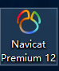
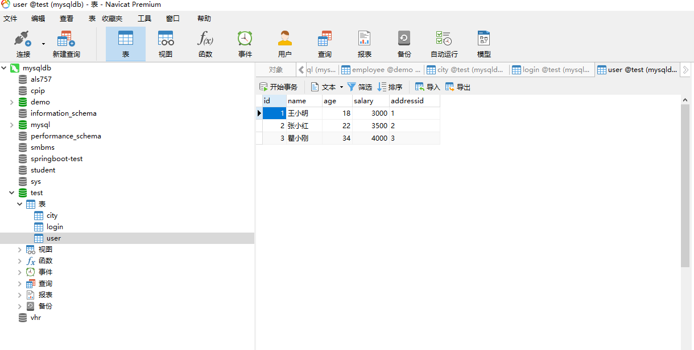

### JsonDemo-web
1. 技术:springboot2+ 、mybatis、jdk1.8+  
```java
    <parent>
        <groupId>org.springframework.boot</groupId>
        <artifactId>spring-boot-parent</artifactId>
        <version>2.0.0.RELEASE</version>
    </parent>
    <dependencies>
        <dependency>
            <groupId>org.springframework.boot</groupId>
            <artifactId>spring-boot-starter-tomcat</artifactId>
        </dependency>
        <dependency>
            <groupId>commons-dbcp</groupId>
            <artifactId>commons-dbcp</artifactId>
            <version>1.4</version>
        </dependency>

        <dependency>
            <groupId>mysql</groupId>
            <artifactId>mysql-connector-java</artifactId>
            <version>5.1.47</version>
        </dependency>
        <dependency>
            <groupId>org.mybatis.spring.boot</groupId>
            <artifactId>mybatis-spring-boot-starter</artifactId>
            <version>1.3.2</version>
        </dependency>
        <dependency>
            <groupId>com.alibaba</groupId>
            <artifactId>fastjson</artifactId>
            <version>1.2.41</version>
        </dependency>
        <dependency>
            <groupId>org.springframework.boot</groupId>
            <artifactId>spring-boot-starter</artifactId>
        </dependency>
        <dependency>
            <groupId>org.springframework.boot</groupId>
            <artifactId>spring-boot-starter-web</artifactId>
        </dependency>
        <dependency>
            <groupId>com.alibaba</groupId>
            <artifactId>fastjson</artifactId>
            <version>1.2.41</version>
        </dependency>
    </dependencies>
```
2. 数据库:mysql 5.7  
工具Navicat Premium 12  
>   
>  
3. 服务接口代码块部分展示(restful接口)：
```java
//列表展示
@RequestMapping(value = "city",method = RequestMethod.GET)
    public JSONObject getCityList(){
        List<City> citys=service.getCityList();
       JSONObject json=new JSONObject();
       json.put("citys",citys);
       json.put("count",service.getCount());
       return json;
    }
    //新增
    @RequestMapping(value = "city",method = RequestMethod.POST)
    public JSONObject addCity(@RequestBody City city){
        JSONObject json=new JSONObject();
            if(service.addCity(city)>0){
                json.put(CommonStatus.CityStatus,CommonStatus.Success);
            }
            else{
                json.put(CommonStatus.CityStatus,CommonStatus.Error);
            }
        return json;
    }
    //更新
    @RequestMapping(value = "city",method = RequestMethod.PUT)
    public JSONObject updateCity(@RequestBody City city){
        JSONObject json=new JSONObject();
       if(service.updateCity(city))
           json.put(CommonStatus.CityStatus, CommonStatus.Success);

       else
           json.put("CityStatus", CommonStatus.Error);
        return json;
    }
    //删除
    @RequestMapping(value = "city/{id}",method = RequestMethod.DELETE)
    public JSONObject deleteCity(@PathVariable Integer id){
        JSONObject json=new JSONObject();
        if(service.deleteCity(id))
            json.put(CommonStatus.CityStatus,CommonStatus.Success);
        else
            json.put(CommonStatus.CityStatus,CommonStatus.Error);
        return json;
    }
```
4. IDE工具 idea  
>
------------------------------------------------
##### 项目贴图请看vue  
[前端项目路径](https://github.com/niujt/JsonDemo-vue) 

  

